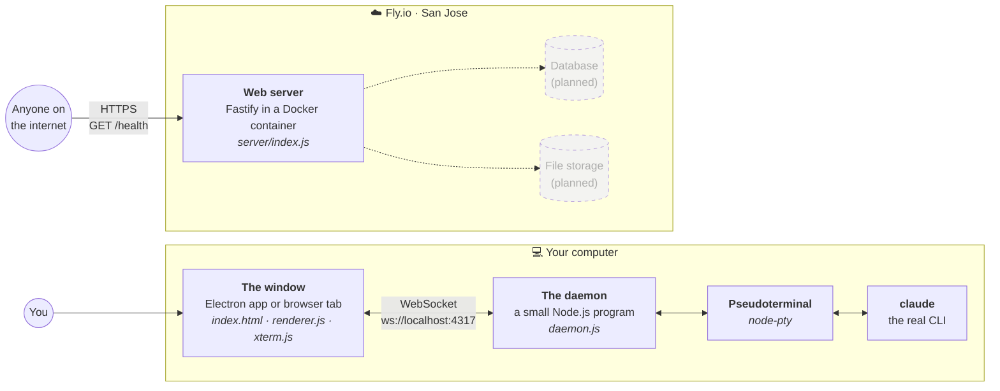
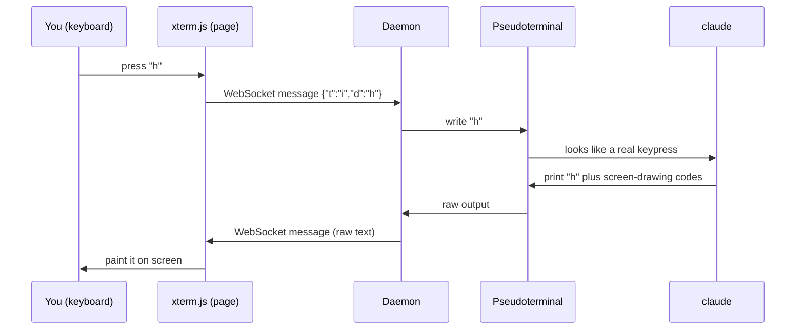

# Plaude

*Walking slowly, on purpose.*

Plaude is a deliberately small app. It takes the [Claude Code](https://claude.com/claude-code) command-line tool and shows it in a window instead of your terminal, either a desktop app or an ordinary browser tab.

Faster and better tools already exist, and that's fine. Plaude is a learning journey. Instead of sprinting to a finished product, we add **one piece at a time**, stopping at each step to understand what that piece is and why it's there.

**This README is a guide to the pieces.** It won't teach you to write each part from scratch. It explains what each technology is, what job it does, and how the parts connect, so you understand the shape of a real end-to-end app well enough to recognize the same pieces in any other one.

> Plaude is a personal learning project and is not affiliated with or endorsed by Anthropic.

---

## Contents

1. [The big picture](#the-big-picture)
2. [The pieces](#the-pieces)
   - On your computer: [Claude Code CLI](#1-the-claude-code-cli) · [Terminals & pseudoterminals](#2-terminals-and-pseudoterminals-pty) · [Node.js](#3-nodejs) · [The daemon](#4-the-daemon) · [WebSockets](#5-websockets) · [The web page & xterm.js](#6-the-web-page-and-xtermjs) · [Electron](#7-electron) · [Security: Origin & token](#8-security-the-origin-check-and-the-secret-token)
   - In the cloud: [Web servers, routes & JSON](#9-web-servers-routes-and-json-fastify) · [Docker](#10-docker-and-containers) · [Fly.io](#11-flyio-hosting)
   - Holding it together: [Git & GitHub](#12-git-and-github)
3. [Follow a keystroke](#follow-a-keystroke)
4. [The journey so far and what's next](#the-journey-so-far-and-whats-next)
5. [Running it yourself](#running-it-yourself)
6. [Glossary](#glossary)

---

## The big picture

Plaude is really **two separate systems** that don't talk to each other yet:



**Left: the terminal bridge (working today).** Claude Code has to run on the machine where your files and projects are, so this part stays on your computer. The window shows what `claude` prints and sends back what you type.

**Right: the cloud backend (just a skeleton so far).** A web server running on the public internet. Right now it answers one question, "are you alive?" Eventually it will handle things that belong in the cloud: user accounts, logins, stored files, and connections to services like Google Drive.

Why keep them separate? They have different jobs and different rules. The bridge needs your local disk. The backend needs to be reachable from anywhere. Most real apps split the same way, into a **client** that runs near the user and a **server** that runs somewhere shared.

---

## The pieces

Each piece is described the same way:

- **What it is**: the technology in plain terms
- **Its job here**: what it does in Plaude specifically
- **Think of it like**: an everyday comparison
- **Lives in**: where to find it in this repo
- **Alternatives**: other tools that fill the same slot, since almost every piece is swappable

### 1. The Claude Code CLI

- **What it is:** a command-line program (you type `claude` in a terminal) that lets an AI assistant read, write and run things in your projects. *CLI* stands for command-line interface: a program you drive by typing text rather than clicking buttons.
- **Its job here:** it's the whole point. Plaude doesn't reimplement any of Claude Code. It runs the real, unmodified `claude` program and passes everything through.
- **Think of it like:** the performer on stage. Everything else in Plaude is the theater: the stage, the lights, the ticket booth.
- **Lives in:** nowhere in this repo. It's installed separately on your computer, and `daemon.js` starts it.

### 2. Terminals and pseudoterminals (PTY)

- **What it is:** a **terminal** is the text window where command-line programs run. Programs like `claude` do more than print lines. They redraw the screen, move the cursor, use colors and react to every keypress, and they only do this if they believe they're connected to a real terminal. A **pseudoterminal** (*PTY*) is a fake terminal that the operating system provides. To the program it looks exactly like a real one, but another program sits on the other end, reading everything it prints and feeding it keystrokes.
- **Its job here:** it fools `claude` into behaving normally. Without a PTY, `claude` would notice it isn't in a terminal and fall back to plain, non-interactive output.
- **Think of it like:** a ventriloquist's dummy with a hidden microphone. `claude` thinks it's talking to a person at a keyboard. Really, Plaude is listening and talking through the PTY.
- **Lives in:** `daemon.js`, using the `node-pty` library (the same one VS Code uses for its built-in terminal).
- **Alternatives:** Python's `pty` module, or `tmux`/`ssh`, which rely on PTYs internally.

### 3. Node.js

- **What it is:** JavaScript was originally built to run only inside web browsers. **Node.js** lets JavaScript run anywhere, as a normal program on your computer or a server. It comes with **npm**, a huge library of ready-made packages you can install with one command.
- **Its job here:** nearly everything in Plaude is JavaScript running on Node: the daemon, the Electron shell and the cloud server. Using one language everywhere means less switching between languages, and the building blocks (`node-pty`, `ws`, `fastify`) are all npm packages.
- **Think of it like:** an engine that lets one language drive in places it couldn't go before.
- **Lives in:** `package.json` (the list of packages the app needs) and `package-lock.json` (the exact versions installed).
- **Alternatives:** Python, Go, Rust, Java, Deno or Bun. Any of them could build the same pieces.

### 4. The daemon

- **What it is:** *daemon* is an old Unix word for a program that runs in the background with no window of its own, doing a job for other programs. Ours is a plain Node.js program, and it only runs as long as something keeps it running.
- **Its job here:** it owns the connection to `claude`. It starts `claude` inside a PTY, then relays in both directions: output from `claude` goes to the window, and keystrokes from the window go to `claude`.
- **Why it's its own program:** this is the most important design decision so far. Because the daemon is separate from the window and talks over a network connection, **the window doesn't care where the daemon is.** Today they sit on the same computer. The same page could later connect to a daemon running somewhere else, which is how "use it from anywhere" becomes possible without rewriting the frontend.
- **Think of it like:** a switchboard operator connecting two callers.
- **Lives in:** `daemon.js`

### 5. WebSockets

- **What it is:** the normal web works like mailing letters. The browser sends a request, the server sends one response, and the exchange is over (this is **HTTP**). A **WebSocket** is more like a phone call. It starts as an ordinary HTTP request (a *handshake*), then "upgrades" into a connection that stays open, where either side can send messages at any moment.
- **Its job here:** a terminal needs that phone call. `claude` might print something at any moment, and you might press a key at any moment. Opening a new request for every single character would be slow and wasteful.
- **What travels over it:** from the page to the daemon, small labeled messages: `{"t":"i","d":"h"}` means "input: the letter h", and `{"t":"r","cols":120,"rows":40}` means "the window was resized". From the daemon to the page, the raw text `claude` printed.
- **Think of it like:** a phone line left open, instead of a stack of letters.
- **Lives in:** `daemon.js` (the server side, using the `ws` library) and `renderer.js` (the browser side, using the `WebSocket` feature built into every browser).
- **Alternatives:** Server-Sent Events (server-to-browser only), WebRTC (peer-to-peer), or long-polling (repeated requests that imitate a phone call).

### 6. The web page and xterm.js

- **What it is:** an ordinary web page. **HTML** (`index.html`) describes what's on the page, and **JavaScript** (`renderer.js`) makes it do things. **xterm.js** is a library that draws a fully working terminal inside a web page.
- **Its job here:** it's what you see. `claude` doesn't just print plain text. It prints text mixed with hidden control codes (*ANSI escape codes*) that mean things like "turn red", "move the cursor up three lines" or "clear the screen". xterm.js understands those codes and paints the result, so the window looks exactly like your real terminal.
- **Why it's a plain web page:** it deliberately uses nothing specific to Electron. It runs unchanged inside the Electron app or in a normal Chrome tab. **Write the interface once, run it in either place** is the idea behind the whole architecture.
- **Think of it like:** a TV screen. It doesn't create the show. It just displays whatever signal comes in.
- **Lives in:** `index.html`, `renderer.js`
- **Alternatives:** hterm (Google's terminal for web pages). For regular app screens you'd reach for a UI framework like React or Svelte.

### 7. Electron

- **What it is:** a toolkit for turning a web page into a desktop app. It bundles a copy of the Chrome browser engine together with Node.js. Many desktop apps you already use are built this way: VS Code, Slack, Discord, Figma's desktop app.
- **Its job here:** very little, on purpose. `main.js` does two things: it starts the daemon, then it opens a window showing the web page. That's the whole job.
- **Think of it like:** a picture frame. It makes the web page feel like a "real" app with its own dock icon and window, but the picture inside is the same.
- **Lives in:** `main.js`
- **Alternatives:** Tauri (smaller, uses Rust and the operating system's built-in browser engine), or fully native apps (Swift on macOS, C# on Windows).

### 8. Security: the Origin check and the secret token

- **The problem:** the daemon listens on your computer at `localhost:4317`, and anything that connects to it gets a live `claude` session, which can run commands on your machine. It turns out **any website open in your browser** can try to open a WebSocket to `localhost`. Without protection, a malicious page could quietly connect and start typing commands. This attack has a name: *cross-site WebSocket hijacking*.
- **The fix, part 1: the Origin check.** When a browser opens a WebSocket, it attaches an **Origin** label saying which site the request came from, and page scripts can't forge it. The daemon only accepts connections labeled as coming from our own page loaded from your disk.
- **The fix, part 2: a secret token.** Every time Plaude starts, it generates a new random 64-character secret. Electron gives it to the daemon (through an *environment variable*, a setting passed to a program when it starts) and to the page (in the part of the address after `#`, which browsers never send over the network). The page must present the token to connect.
- **Why both:** each layer covers a gap in the other. This habit of stacking protections is called **defense in depth**.
- **When it happens:** both checks run during the WebSocket handshake, **before** `claude` is started. A rejected visitor never gets anywhere near a terminal.
- **Think of it like:** a building that checks both your ID badge (Origin) and a password that changes daily (token).
- **Lives in:** `daemon.js` (the `verifyClient` check), `main.js` (creates the token), `renderer.js` (sends it).
- **What it doesn't cover yet:** this protects a daemon that only listens on your own computer. Reaching the app over the internet will also need real user logins and encrypted connections (`wss://`, the WebSocket version of `https://`). That's later on the journey.

### 9. Web servers, routes and JSON (Fastify)

- **What it is:** a **web server** is a program that waits for HTTP requests and sends back responses. **Fastify** is a Node.js library that handles the tedious parts (reading requests, managing many connections at once, formatting responses), so you only write "when *this* request arrives, do *this*."
- **Routes:** a route is one rule of the form "*this method* + *this path* → *run this function*." For example, `GET /health` means "when someone *asks for* (GET) the address `/health`, run the health function." An app's server is mostly a list of routes. Common methods are GET (fetch something), POST (create something), PUT/PATCH (change something) and DELETE.
- **`/health`:** our only route. It does no real work and simply replies "I'm alive, and here's the time." Hosting platforms and monitoring tools check routes like this constantly to know whether a server is up.
- **JSON:** the reply is **JSON** (JavaScript Object Notation), a plain-text format for structured data that nearly every programming language can read and write. It's the common language of web servers: `{"status":"ok","time":"2026-09-26T02:22:07.261Z"}`. It isn't a page meant to be looked at. It's data meant to be read by code.
- **Think of it like:** a receptionist with a rulebook. When a request comes in, find the matching rule and follow it.
- **Lives in:** `server/index.js`
- **Alternatives:** Express, Hono or NestJS (Node), FastAPI or Django (Python), Rails (Ruby), Go's built-in `net/http`.

### 10. Docker and containers

- **What it is:** the classic problem in software is "it works on my machine." **Docker** solves it by packing an app together with *everything* it needs (the right Node version, its packages, its files) into a sealed bundle called an **image**. A running copy of an image is a **container**. Any computer that runs Docker runs the container identically.
- **Its job here:** the `Dockerfile` is the recipe for the server's image. In plain English: *start from a small Linux system with Node 22 already installed → copy in the package list → install the packages → copy in the code → listen on port 8080 → run `node index.js`.* The `.dockerignore` file lists what to leave out of the image.
- **Think of it like:** a shipping container. The crane doesn't care what's inside because every container is the same shape, so any ship (any server) can carry it.
- **Lives in:** `server/Dockerfile`, `server/.dockerignore`
- **Alternatives:** Podman (a compatible drop-in), Buildpacks (build images automatically without a Dockerfile), or just running the code directly on a server (the traditional way).

### 11. Fly.io (hosting)

- **What it is:** a **hosting** company that runs your containers in data centers around the world. You hand Fly.io a Dockerfile and it builds the image, starts it on small virtual machines (*Fly Machines*), gives it a public address, and handles HTTPS encryption for you.
- **Its job here:** it puts the server on the real internet at **https://plaude.fly.dev**. Our settings are in `fly.toml`:
  - `primary_region = 'sjc'`: run in San Jose.
  - `memory = '512mb'`, one shared CPU: a small, cheap machine.
  - `auto_stop_machines` + `min_machines_running = 0`: **scale to zero.** When nobody is using the server, the machine shuts off and stops costing money. The next request wakes it up, which takes about a second. This trade-off between cost and speed (idle costs nothing, but the first request is slower, called a *cold start*) comes up constantly in real systems.
  - `force_https = true`: plain `http://` visitors are redirected to the encrypted `https://`.
- **Infrastructure as code:** because the recipe (`Dockerfile`) and settings (`fly.toml`) are files in the repo, moving the server is easy. When this project was renamed, moving from the old Fly app to `plaude` took one changed line and a redeploy.
- **Think of it like:** renting a stall in a market that opens only when a customer walks up.
- **Lives in:** `server/fly.toml`
- **Alternatives:** Railway or Render (similarly simple), or AWS, Google Cloud and Azure (more powerful, much more setup).

### 12. Git and GitHub

- **What it is:** **Git** records snapshots (*commits*) of your code over time, so you can see what changed, when and why, and go back if something breaks. **GitHub** is a website that hosts Git repositories so they're backed up, shareable and public. You're reading this on GitHub right now.
- **Its job here:** every step of the journey is a commit. The history (`git log`) is itself a record of the project, built one piece at a time. The `.gitignore` file lists what should never be committed: downloaded packages (`node_modules/`, which can always be reinstalled) and secret files (`.env`).
- **Think of it like:** a save-game system with a note attached to every save.
- **Alternatives:** GitLab or Bitbucket (other Git hosts), Mercurial (a different version-control system).

---

## Follow a keystroke

Here's how the pieces work together when you actually use Plaude.

### When the app starts (`npm start`)

1. **Electron** starts (`main.js`) and generates a fresh **secret token**.
2. Electron launches the **daemon** (`daemon.js`) as a background program and gives it the token.
3. The daemon starts listening at `127.0.0.1:4317`. `127.0.0.1` means "this computer only", so other devices on your network can't reach it. It reports back: *"listening."*
4. Electron opens a **window** showing `index.html#token=…`.
5. The page (`renderer.js`) opens a **WebSocket** to the daemon and presents the token.
6. The daemon checks the **Origin** and the **token**. Both pass.
7. The daemon starts `claude` inside a **pseudoterminal**. Claude's welcome screen flows back over the WebSocket, and **xterm.js** draws it.

### When you press a key



Everything stays on your computer, so the whole round trip takes a few milliseconds. That's fast enough to feel just like a normal terminal.

### When you resize the window

The page measures how many columns and rows of characters now fit, sends `{"t":"r","cols":…,"rows":…}`, and the daemon resizes the pseudoterminal. `claude` gets notified and redraws its layout to fit.

---

## The journey so far and what's next

| Step | What it adds | What it teaches | Status |
|---|---|---|---|
| 0 | Terminal in a window | PTYs, WebSockets, client/daemon split, Electron | ✅ Done |
| 0.5 | Origin check + secret token | Local attack surface, defense in depth | ✅ Done |
| 1 | Cloud server skeleton | Web servers, routes, JSON, Docker, hosting, scale-to-zero | ✅ Done |
| 2 | Accounts & login | Databases (Postgres), password hashing, login tokens (JWT), storing secrets safely | 🚧 Next |
| 3 | File uploads | Object storage (Cloudflare R2 / S3), uploading large files, metadata vs. file contents | ⏳ Planned |
| 4 | Google Drive connection | OAuth (what happens behind "Sign in with Google"), keeping third-party access tokens on the server | ⏳ Planned |
| 5 | Media in the window | Showing images and PDFs inline instead of as file paths | ⏳ Planned |
| 6 | Speed & scale pass | Caching (Redis), background jobs, rate limiting, logging & monitoring | ⏳ Planned |

Each step gets added to this guide as it's built.

---

## Running it yourself

You'll need macOS or Linux, [Node.js](https://nodejs.org) 20+, and [Claude Code](https://claude.com/claude-code) installed and logged in.

```bash
git clone https://github.com/mishep/plaude.git
cd plaude
npm install        # installs packages and builds node-pty for Electron
npm start          # opens the Plaude window
```

**In a browser tab instead:** run `node daemon.js`. It prints a `file://…#token=…` address. Paste that into Chrome.

**The cloud server locally:** `cd server && npm install && npm start`, then visit `http://localhost:8080/health`.

---

## Glossary

| Term | Meaning |
|---|---|
| **ANSI escape codes** | Hidden instructions mixed into terminal text: colors, cursor moves, screen clears |
| **Client / server** | The part near the user (client) and the shared part it talks to (server) |
| **Cold start** | The delay when a stopped server has to wake up to answer a request |
| **Commit** | One saved snapshot in Git's history |
| **Container / image** | Image: a sealed package of an app and everything it needs. Container: a running copy of one |
| **Daemon** | A background program with no window, doing a job for other programs |
| **Defense in depth** | Stacking several independent protections so one gap doesn't mean total failure |
| **Environment variable** | A named setting handed to a program when it starts, often used for configuration and secrets |
| **Handshake** | The opening exchange where two sides agree to connect, and where the server can say no |
| **HTTP / HTTPS** | The request-and-response language of the web. HTTPS is the encrypted version |
| **JSON** | A plain-text format for structured data: `{"key": "value"}` |
| **localhost / 127.0.0.1** | "This computer." Addresses that can't be reached from other machines |
| **npm** | Node's package manager: a library of reusable code, plus the tool that installs it |
| **Origin** | The label a browser attaches saying which site a request came from |
| **Port** | A numbered door on a computer. Different programs listen at different doors (`4317`, `8080`) |
| **PTY (pseudoterminal)** | A fake terminal the operating system provides, letting one program pose as a keyboard and screen for another |
| **Route** | A rule on a web server: method + path → function |
| **Scale to zero** | Shutting servers off entirely when idle, so they cost nothing |
| **Token** | A secret string that proves you're allowed in |
| **WebSocket** | A connection that stays open so both sides can send messages at any time |
